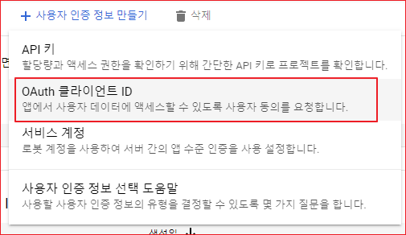
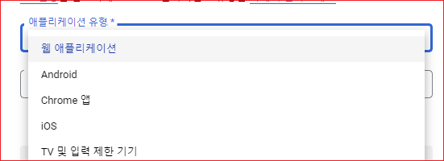
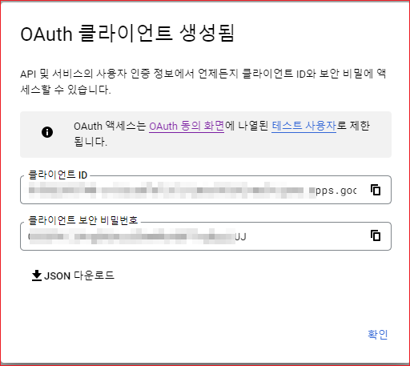

# OAuth 


OAuth 인증 방식을 사용하려면 [구글 클라우드 콘솔](https://console.cloud.google.com/)에서 OAuth 2.0 클라이언트 아이디를 먼저 생성해야 한다.  다음의 순서대로 인증정보를 생성한다. 

1. 클라우드 콘솔에 로그인한다. 
2. OAuth 동의화면을 생성한다. 
3. API 및 서비스 > 사용자 인증정보를 클릭한다. 
4. 사용자 인증정보 만들기를 클릭한다. 
5. OAuth 클라이언트 아이디를 선택한다. 
6. 애플리케이션 유혀항목에서 웹 애플리케이션을 선택한다. 
7. 승인된 리디렉션 URI를 입력한다. 
8. 만들기를 클릭한다. 


## 사용자 인증 정보 

"API 및 서비스 > 사용자 인증 정보"를 선택한다. 

사용자 인증정보 만들기를 클릭한다. 

OAuth 클라이언트 ID를 선택




"애플리케이션 유형"에서 "웹 애플리케이션"을 선택한다. 




이름 항목에 웹 클라이언트 이름을 입력한다. 

승인된 리디렉션 URI를 클릭하여 URI 항목에 콜백 URL을 입력한다. 

```
https://your.domain.com/oauth/callback
```


만들기를 클릭한다.

"OAuth 클라이언트 생성됨" 화면이 표시된다. 




확인을 클릭하면 사용자 인증 정보 화면이 표시된다. 생성된 OAuth 2.0 클라이언트 ID가 목록에 표시된다. 


