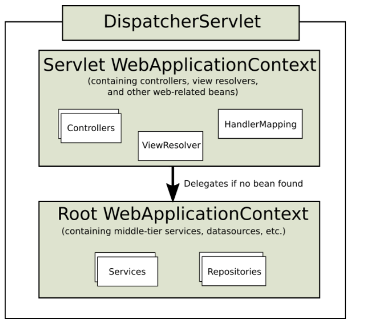

# 컨텍스트 분리

## Spring Boot에서의 Context 분리

**Spring Boot에서는 root web application context와 servlet web application context에 대한 구분이 없다**. 디폴트로 single web application context를 생성할 것이다. Embedded container 안에서 돌아가는 Spring Boot Web application들은 설계에 의해 어떠한 WebApplicationInitializer를 실행하지 않는다. 선택된 배포 전략에 따라 SpringBootInitializer 또는 ServletContextInitializer에서 같은 로직을 작성할 수는 있다. 그러나, servlets, filters, listeners 이 기사에서 보여진 것과같은 것들에 대해서는, 사실 Spring Boot 가 자동적으로 모든 서블릿 관련된 Bean을 컨테이너에 등록한다.

따라서 Spring Boot Web Application에서는 아래의 내용은 의미가 없다. Spring Boot에서는 @SpringBootApplication 어노테이션을 적용하여 Application의 진입점을 만든다. @SpringBootApplication 어노테이션을 적용할 Main Class는 패키지 루트에 생성해야 한다. 예를들어 com.sogood.common, com.sogood.biz 와 같은 형태로 패키지 구조를 만든다면 메인 클래스는 com.sogood 패키지 아래에 두어야 한다.

```
📁src/main/java
  📁com
    📁sogood
      📄 SogoodApplicaion.java
      📁core
        📁log
```

@SpringBootApplication이 적용된 SogoodApplicaion.java가 있는 패키지가 basePackage가 되기 때문에 @ComponentScan을 적용할 필요가 없다. 간단히 SogoodApplicaion.java를 다음과 같이 작성한다.

```java
package com.sogood;

import org.springframework.boot.SpringApplication;
import org.springframework.boot.autoconfigure.SpringBootApplication;

@SpringBootApplication
public class SogoodApplication {
	public static void main(String[] args) {
		SpringApplication.run(SogoodApplication.class, args);
	}
}///~
```

Spring Boot가 어떻게 처리하던 논리적으로 추가적으로 Bean을 생성하기 위해서는 AppConfig.java를 만드는 것이 좋을 것이다.

## Spring MVC에서의 컨텍스트 분리

Spring MVC 웹 프로젝트를 생성하면 기본적으로 두 개의 컨텍스트를 생성한다. @Controller, @Service, @Repository 등의 어노테이션을 사용한 빈들을 사용하기 위해서는 어느 한 컨텍스트에 등록해야 한다.

DispatcherServlet 은 일반적으로 계층 구조를 갖는다. 많은 애플리케이션에는 단일 DispatcherServlet, 단일 WebApplicationContext 를 갖는 컨텍스트 구조를 만든다. WebApplicationContext 를 루트 컨텍스트(부모 컨텍스트)라고 부르고 DispatcherServlet 은 자식 컨텍스트 구조를 갖는다.

DispatcherServlet 은 요청에 대응할 수 있는 Controller, ViewResolver, HandlerMapping 과 같은 스프링 빈(Beans)을 구성하고, WebApplicationContext 에는 모든 서블릿이 공유할 수 있는 Service, Repository 와 같은 스프링 빈을 구성한다.

* Servlet Context: DispatcherServlet, Spring-MVC와 관련 있는 빈(Controller, ViewResolver, HandlerMapping 등)을 설정
* Root Context: Spring-MVC와 분리되어 빈을 관리하고 싶을 때(Service 빈이나 Repository 빈 등)



**Root Application Context**

* 서로 다른 서블릿 컨텍스트에서 공유해야하는 빈들을 등록
* 이 컨텍스트에 등록되는 빈들은 모든 컨텍스트에서 사용
* DB연결, 로깅 기능
* Servlet Context에 등록된 빈 이용 불가능
* 둘다 등록되어 있다면 Servlet Context 빈이 우선된다.

**Servlet Application Context**

* 서블릿 컨텍스트에서만 이용되는 컨텍스트

### ServletContext 설정

Servlet Context에서 등록할 스프링 컴포넌트들을 스캔하기 위해서 @ComponentScan 어노테이션을 붙인다. Root Application Context에 등록할 컴포넌트를 제외하기 위해서 @ComponentScan.Filter를 사용하여 제외시킨다.

```java
package com.sogood.core.config;

import org.springframework.context.annotation.ComponentScan;
import org.springframework.context.annotation.Configuration;
import org.springframework.context.annotation.FilterType;
import org.springframework.stereotype.Controller;
import org.springframework.stereotype.Repository;
import org.springframework.stereotype.Service;
import org.springframework.web.servlet.config.annotation.EnableWebMvc;
import org.springframework.web.servlet.config.annotation.ResourceHandlerRegistry;
import org.springframework.web.servlet.config.annotation.WebMvcConfigurer;


@EnableWebMvc
@Configuration
@ComponentScan(basePackages = {"com.sogood"}
        , includeFilters = {@ComponentScan.Filter(type = FilterType.ANNOTATION, value = Controller.class)}
        , excludeFilters = { // 제외할 컴포넌트들을 설정한다
        @ComponentScan.Filter(type = FilterType.ANNOTATION, value = Service.class),
        @ComponentScan.Filter(type = FilterType.ANNOTATION, value = Repository.class),
        @ComponentScan.Filter(type = FilterType.ANNOTATION, value = Configuration.class) 
      })        
public class DispatcherConfig implements WebMvcConfigurer {
}///~
```

> 스프링 부트 2.0부터 Java8과 스프링 5.0을 사용하면서 WebMvcConfigurer 메서드에 default를 선언했다. 그 덕분에 WebMvcConfigurer를 구현하는 클래스에서 모든 메서드를 구현해야하는 강제력이 사라졌다

### Root Application Context 분리

com.sogood.core.config 패키지에 AppConfig.java 파일을 생성하고 다음과 같이 입력한다. @ComponentScan.Filter를 사용하여 Contrller.class는 제외한다. 마찬가지로 DispatcherConfig.java도 제외하도록 한다.

```java
package com.sogood.core.config;

import org.springframework.context.annotation.ComponentScan;
import org.springframework.context.annotation.Configuration;
import org.springframework.context.annotation.FilterType;
import org.springframework.stereotype.Controller;

@Configuration
@ComponentScan(basePackages = { "com.sogood" } 
, excludeFilters = { // 제외할 컴포넌트들을 설정한다
	 @ComponentScan.Filter(type = FilterType.ANNOTATION, value = Controller.class),
   @ComponentScan.Filter(type = FilterType.REGEX, pattern = "com.sogood.*.*DispatcherConfig+")   
})
public class AppConfig {
  
}///~
```
